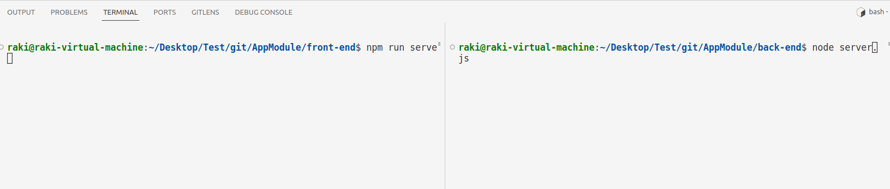

## Requirements & INSTALL
node版本供参考
1. node : 12.22.9
2. npm  : 8.5.1

- change npm registry （换源后记得重启终端，如果在编辑器中使用集成终端，需要重启编辑器）
```
sudo npm config set registry https://registry.npmmirror.com --global
```

- check npm registry
```
npm config get registry
```

- install vue脚手架
```
npm install  @vue/cli
sudo npm install -g @vue/cli --registry=https://registry.npmmirror.com
```

### 安装依赖
在`front-end`和`back-end`文件夹下分别执行
```
npm install --registry=https://registry.npmmirror.com
```

### 尝试运行


### GIT
1. ssh


1. clone
2. config your git
3. commit
4. push (ssh)


From LI use ssh
